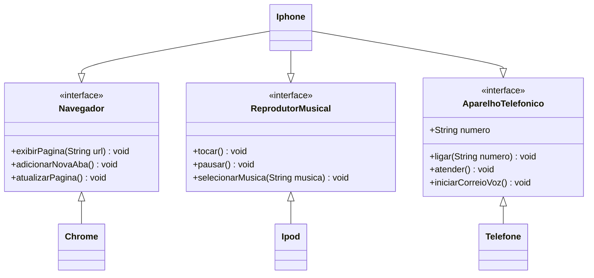

# dio-lab-iphone-uml
Repositório do lab "Modelando o iPhone com UML" da Digital Innovation One.

### Objetivo
1. Criar um diagrama UML que represente as funcionalidades descrita no [projeto](https://github.com/digitalinnovationone/trilha-java-basico/blob/main/desafios/poo/README.md).
2. Implementar as classes e interfaces correspondentes em Java.

### Diagrama UML
Criação do diagrama conforme requisitado. Utilizei Mermaid a fim de conhecer melhor esta forma de modelagem.

## Links úteis
[Documentação Mermaid](https://mermaid.js.org/intro/)

[Página no GitHub contendo informações do desafio proposto
](https://github.com/digitalinnovationone/trilha-java-basico/blob/main/desafios/poo/README.md)

[Desafio na plataforma DIO](https://web.dio.me/lab/desafio-de-projeto-1/learning/6d16483b-8e3c-4275-9e1d-9ecea46a839c?back=/play)